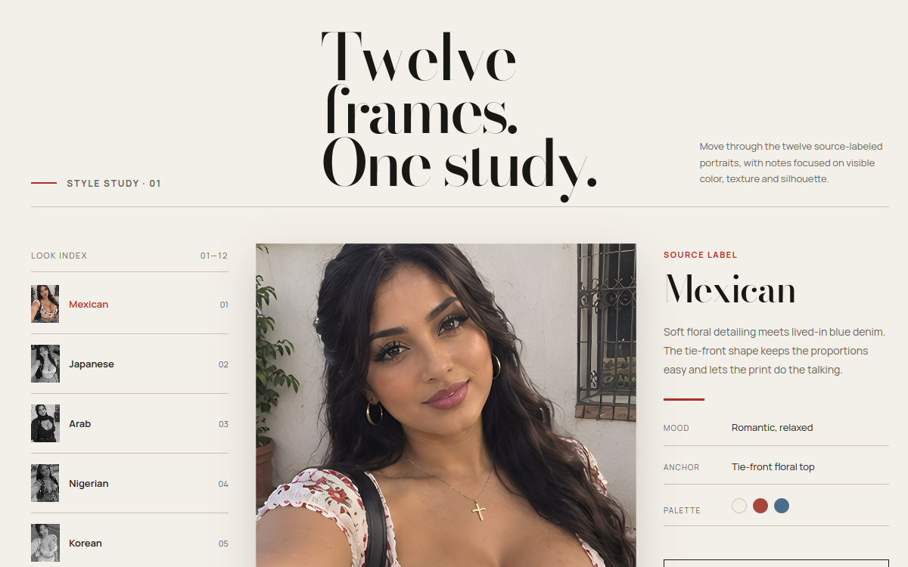

<p align="center">
  <a href="https://elderly-coder.github.io/portrait-index/">
    
  </a>
</p>

<h1 align="center">Portrait Index</h1>

<p align="center">
  Twelve frames. One study. A browsable portrait gallery.
</p>

<p align="center">
  <a href="https://elderly-coder.github.io/portrait-index/">
    
  </a>
  
</p>

## Live

**https://elderly-coder.github.io/portrait-index/**

## What it is

A style-study gallery: twelve source-labeled portraits with notes on visible color, texture, and silhouette. Move through the look index on the left, inspect each frame on the right.

## Run it locally

It is one self-contained HTML file. Open `index.html` in any browser, or serve the folder:

```bash
python -m http.server 8000
```
